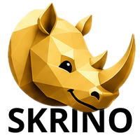

# Skrino



Fast Windows screenshot and screen-recording tool with one-click upload.

Быстрая скриншотилка для Windows: хоткей, выделение области, редактор (стрелки, текст, фигуры, маркер, размытие, обрезка), «Поделиться» в локальную папку или на свой сервер по FTP/FTPS/SFTP со ссылкой в буфере обмена. Плюс запись экрана в MP4 (без ffmpeg) с той же логикой «Поделиться».

Нативный Rust + egui: фоновый процесс в трее занимает ~9 МБ памяти, UI запускается только на время работы. Один exe ~13 МБ без зависимостей.

Техническое описание архитектуры: [TECHNICAL.md](TECHNICAL.md)

## Требования

- Windows 10 или 11 (64-бит).
- Для записи экрана нужна Windows 10 версии 1903 или новее (используется Windows.Graphics.Capture).
- Ничего дополнительно ставить не нужно: exe статически слинкован с CRT, Visual C++ Redistributable не требуется.
- Для сборки из исходников нужен Rust 1.85+ (stable), edition 2024.

## Сборка

Нужны: [Rust](https://rustup.rs) (stable) и MSVC Build Tools.

```powershell
cargo build --release
# результат: target\release\skrino.exe
```

## Запуск

Запустите `skrino.exe`: откроется стартовое окно «Область», «Весь экран», «Открыть файл», второй ряд «Записать область» и «Записать экран», внизу «Настройки». При закрытии окна Skrino остаётся в фоне (иконка-носорог в трее), и хоткеи продолжают работать.

| Действие | Как |
|---|---|
| Скриншот области | `Ctrl+Shift+3` (или трей: «Скриншот области») |
| Скриншот всего экрана | `Ctrl+Shift+4` |
| Записать область | `Ctrl+Shift+5` (или трей: «Записать область») |
| Записать весь экран | `Ctrl+Shift+6` |
| Открыть стартовое окно | клик по иконке в трее |
| Настройки | трей: «Настройки» |
| Выход из фона | трей: «Выход» |

В оверлее выделения: тянуть мышью, чтобы выделить; `Enter` или двойной клик, чтобы подтвердить; `Esc` или правый клик, чтобы отменить.

## Редактор

Инструменты: Стрелка, Текст, Фигуры (внутри: прямоугольник, эллипс, линия, метка-нумерация), Маркер (внутри: маркер, карандаш), Размытие, Обрезать. У групп тип выбирается во втором ряду тулбара, там же толщина и цвет.

Горячие клавиши: `Ctrl+Z`/`Ctrl+Y` отмена/повтор, `Ctrl+C` копировать картинку, `Ctrl+S` сохранить, `Ctrl+Enter` поделиться, `Ctrl+колесо` зум. Открывается в масштабе «по размеру окна».

**Сохранение без вопросов:** первый раз «Сохранить» открывает диалог; после сохранения в тосте есть кнопка «Запомнить папку», дальше сохранение идёт молча в неё. Изменить: настройки, раздел «Сохранение».

**Уведомления:** об успешном копировании, сохранении и полученной ссылке приходят системные уведомления Windows (выключаются в настройках). Если закрыть редактор во время загрузки на сервер, аплоад доработает в фоне и уведомит, когда ссылка окажется в буфере.

## Запись экрана

Требуется Windows 10 версии 1903 или новее (используется Windows.Graphics.Capture). Тот же хоткей запускает и останавливает запись: первое нажатие начинает, повторное завершает.

- **Записать область** (`Ctrl+Shift+5`): оверлей «Выделите область для записи», затем запись выбранного прямоугольника.
- **Записать весь экран** (`Ctrl+Shift+6`): запись монитора под курсором, без оверлея.

Во время записи внизу выделенной области появляется компактная панель управления: красная точка, таймер, пауза, «Стоп» и крестик отмены. Панель можно перетаскивать, она всегда поверх других окон и не попадает в саму запись. Границы записываемой области отмечены тонкой жёлтой рамкой (тоже не попадает в видео).

Куда уходит готовый MP4, определяется тем же разделом «Поделиться», что и для скриншотов: в локальную папку (учитывается «Спрашивать место при каждом сохранении», диалог с фильтром `.mp4`) или на сервер по FTP/FTPS/SFTP, после чего ссылка копируется в буфер и приходит системное уведомление. Настройки записи (частота кадров 15/30/60, запись курсора, хоткеи) находятся в разделе «Запись».

**Ограничения записи:** пишется только один монитор (тот, где выбрана область; для полноэкранной записи это монитор под курсором); запись идёт без звука.

## «Поделиться»: локально или на сервер

Настройки, раздел «Поделиться»:

- **В локальную папку** (по умолчанию `Изображения\Skrino`): файл сохраняется туда, картинка в буфер, тост с путём (клик открывает Проводник). Работает сразу, без настройки.
- **На сервер (FTP/FTPS/SFTP)**: хост, логин, пароль (хранится в системном хранилище Windows, не в конфиге) или SSH-ключ, удалённая папка и шаблон публичной ссылки вида `https://example.com/s/{filename}`. После аплоада ссылка в буфере. Кнопка «Проверить соединение» заливает и удаляет пробный файл.

**Заметка про безопасность:** FTPS и SFTP сейчас принимают любой TLS-сертификат и любой SSH host key сервера, проверка отпечатка (пиннинг) пока не реализована. Для доверенного собственного сервера это нормально, но не защищает от подмены сервера на сетевом пути (подробности в [TECHNICAL.md](TECHNICAL.md)).

## Автозапуск

Настройки → «Общие» → «Запускать в фоне при старте системы» (прописывает `skrino.exe --tray` в HKCU\...\Run).

## Флаги командной строки

| Флаг | Что делает |
|---|---|
| *(без флагов)* | стартовое окно |
| `--tray` | фоновый демон: трей + хоткеи, без GPU (~9 МБ) |
| `--capture-region` | сразу выделение области, потом редактор |
| `--capture-full` | сразу снимок всего экрана, потом редактор |
| `--record-region` | выделение области, затем запись экрана |
| `--record-full` | запись монитора под курсором |
| `--open-file` | открыть картинку в редакторе |
| `--settings` | окно настроек |
| `--start` | то же, что без флагов |

Служебные флаги (для разработки/тестов, не нужны при обычном использовании): `--record-smoke` (безголовый тест записи: 3 секунды primary-монитора, печатает путь MP4, выходит), `--overlay-smoke` (безголовый тест оверлея выделения: автоотмена через 3 секунды, выходит).

## Лицензия

Проприетарная, все права защищены. Исходный код открыт только для ознакомления:
его можно смотреть, а готовый `skrino.exe` можно скачивать и запускать для
личного использования. Изменять код, делать производные, перевыкладывать или
встраивать его в другие проекты без письменного разрешения нельзя. Полный текст
в файле [LICENSE](LICENSE). Сторонние компоненты сохраняют свои лицензии, см.
[THIRD-PARTY-NOTICES.md](THIRD-PARTY-NOTICES.md).
